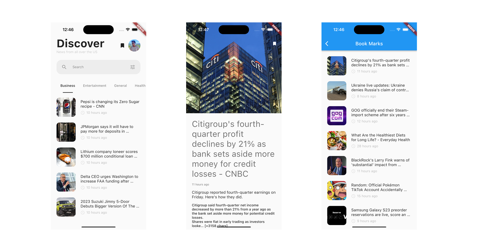

# NEWS APP

#### Demo


#### Developer info
```
Hasan Toufiq Ahamed
hasantoufiqos@gmail.com
```

##### Download APK
<pre><a href="https://drive.google.com/drive/folders/1CA7T4YCRGWqlNTM3CBRoR3_u92c2Di_U">https://drive.google.com/drive/folders/1CA7T4YCRGWqlNTM3CBRoR3_u92c2Di_U</a></pre>

#### Libraries
```
get_storage: for local database.
cached_network_image: for network images.
google_sign_in: for google sign in.
firebase_auth: for authentication.
cloud_firestore: for online datatase.
internet_connection_checker: for check device internet status.
```

## API Reference

#### Base url

```
  https://newsapi.org/
```
#### Get all Top headlines
```
  GET v2/top-headlines
```

| Parameter | Type     | Description                |
| :-------- | :------- | :------------------------- |
| `apiKey` | `string` | **Required**. Your API key  |
| `country` | `string` | **ae**, **ar**, **at**, **au**, . . .  |
| `category` | `string` | **business**, **entertainment**, **general**, . . .  |
| `q` | `string` | Keywords or a phrase to search for  |
| `pageSize` | `int` | The number of results to return per page (request). 20 is the default, 100 is the maximum.  |
| `page` | `int` | Use this to page through the results if the total results found is greater than the page size.|
